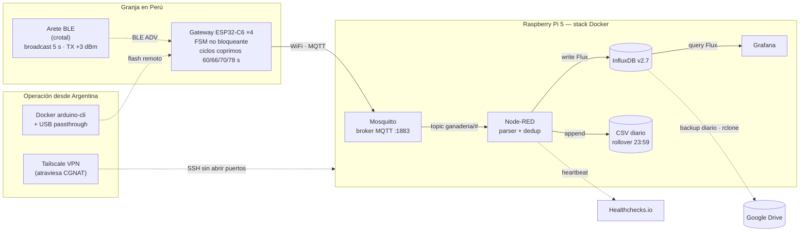

<!-- HERO IMAGE — pendiente hasta que se cargue la foto en docs/img/crotal-marrana-01.jpg.

  

-->

<h1 align="center">Crotcow — Plataforma IoT para ganadería</h1>

  <em>Sistema de telemetría continua en arete BLE, con piloto productivo en una granja del Perú desde 2024 y desarrollo activo de la capa analítica.</em>

  
  
  
  

---

## Resumen ejecutivo

Crotcow es una plataforma de telemetría IoT para ganadería con arquitectura end-to-end propietaria: arete BLE → gateways edge ESP32-C6 → broker MQTT → pipeline en Node-RED → base de datos de series temporales → dashboards. El piloto productivo opera de forma ininterrumpida en una granja porcina del Perú, mientras la operación, el firmware y la capa analítica se mantienen desde Argentina a través de Tailscale VPN.

Este repositorio reúne **documentación técnica pública** del sistema. El firmware embebido, los esquemáticos del arete y el backend analítico son propietarios y no se publican.

---

## Estado del proyecto

| Componente | Estado |
|---|---|
| Firmware del gateway (C++, ESP32-C6) | **Operativo** · 12 correcciones de campo aplicadas |
| Backend de adquisición (MQTT + Node-RED + InfluxDB) | **Operativo** · 18 meses sin pérdida de datos |
| Dashboards de operación (Grafana) | **Operativos** · provisioning declarativo |
| Capa analítica predictiva (CUSUM, Z-score, bout length) | **En desarrollo** · calibración pendiente |
| Sistema de alertas (Telegram / email) | **En desarrollo** |
| Extensión a ganado extensivo (LoRaWAN) | **Roadmap** |

---

## Arquitectura

**Capas del sistema:**

- **Sensores** — aretes BLE propietarios con broadcast cada 5 s y TX +3 dBm.
- **Edge** — 4 gateways ESP32-C6 con firmware C++ no bloqueante, redundancia por ciclos coprimos para evitar superposición de ventanas WiFi.
- **Backend local** — stack Docker sobre Raspberry Pi 5 con persistencia en disco USB-C externo.
- **Operación remota** — Argentina ↔ Perú vía Tailscale, sin apertura de puertos en la red de la granja.

---

## Hardware desplegado

<!-- HARDWARE — gateways. Pendiente hasta que se carguen las fotos.

  
  

-->

Cada gateway integra un módulo ESP32-C6 (RISC-V, WiFi 6, BLE 5) con coexistencia de antena 2.4 GHz, alimentación 5 V y firmware C++ con máquina de estados de 8 estados. La unidad cuesta dos órdenes de magnitud menos que un gateway industrial equivalente.

Los 4 gateways operan en ciclos coprimos (60 / 66 / 70 / 78 s) para que las ventanas de upload por WiFi (durante las cuales el radio único deja de escuchar BLE) no se superpongan de forma permanente. La cobertura efectiva resultante asciende del 35 % (1 GW) al 82 % (4 GW), con degradación graceful ante caída de un nodo.

---

## Competencias técnicas demostradas

**Embebido (C++ / ESP32-C6)**
- Diseño de máquina de estados finitos no bloqueante (8 estados) con modularización en 4 traducciones independientes (`ble_scanner`, `wifi_mgr`, `mqtt_mgr`, `fsm`) y *single source of truth* en `config.h`.
- Resolución de problemas de coexistencia BLE / WiFi en un único radio 2.4 GHz mediante *time multiplexing* y ciclos coprimos entre dispositivos.
- Manejo de concurrencia FreeRTOS: callbacks BLE thread-safe, uso de `volatile` y secciones críticas (`portENTER_CRITICAL`), corrección de race conditions y *dangling pointers* en C++.
- Optimización de pila de red: IP estática con asociación WiFi 5× más rápida, NTP bloqueante en `S_INIT`, deduplicación por dispositivo.

**Backend autohospedado (Docker / Linux)**
- Orquestación de stack de 5 contenedores (Mosquitto, Node-RED, InfluxDB v2, Grafana, Portainer) con persistencia en disco USB-C, `restart: unless-stopped`, `fstab nofail` y rollback de microSD en menos de 30 minutos.
- *Provisioning* declarativo de Grafana (datasources + dashboards versionados) — reproducible en otra granja con `git clone + docker compose up -d`.
- Disaster recovery probado: UPS de 15 min, backup diario a Google Drive vía `rclone`, *dead man's switch* con Healthchecks.io.

**Pipeline analítico**
- Modelado de medidas / tags / fields y consultas Flux (`group`, `sort`, `difference(nonNegative:true)`, `aggregateWindow`, `stddev`, `hourSelection`, `reduce` con estado).
- Métricas de actividad con base bibliográfica revisada: **Ratio**, **WMean winsorizada**, **Transition Rate**, **STD rolling**, **CUSUM tabular** (réplica Cornou 2016, calibrado con `k = 0.5σ`, `h = 4σ`).
- Análisis en Python con `pandas`, `pyarrow`, Jupyter, y CLI con `click`/`hatchling` con escritura atómica (`tmp + rename`, marcadores `_OK`) y clientes Influx *read-only* para evitar corrupción de la fuente.

**Operación remota y DevOps**
- Tailscale VPN sobre WireGuard como solución de acceso remoto bajo CGNAT, sin port forwarding, con latencia SSH típica <250 ms entre Argentina y Perú.
- *Flashing* remoto del firmware mediante contenedor Docker ARM64 con `arduino-cli` y *USB passthrough* vía SSH.
- Automatización con `cron`, `rclone` (OAuth a Google Drive) y *heartbeat* tipo *dead man's switch*.

---

## Resultados cuantitativos

| Métrica | Valor |
|---|---|
| Operación continua del piloto | 18 meses ininterrumpidos |
| Sensores activos en campo | 30 |
| Gateways redundantes | 4 ESP32-C6 |
| Captura BLE (tras 12 correcciones de firmware) | 8 % → 52 % (**6.5×**) |
| Captura del mejor sensor | 18 % → 89 % (**5×**) |
| Crashes por heap exhaustion | `abort()` cada 5–8 ciclos → 0 en >100 h |
| Latencia end-to-end ADV → dashboard | 1–5 s |
| Latencia SSH Argentina ↔ Perú | <250 ms |
| Asociación WiFi por gateway (IP estática) | 400 ms (5× más rápido que DHCP) |
| Cortes de luz / internet superados | Múltiples · auto-recuperación verificada |

<!-- DASHBOARD — captura Grafana 4 marranas, ventana 10 min. Pendiente.

  

-->

---

## Despliegue real

<!-- GALERÍA — marranas con crotal. Pendiente hasta que se carguen las fotos.

  
  
  

-->

El crotal BLE se aplica en la oreja del animal de forma análoga a un arete sanitario convencional. La emisión BLE de 5 s con potencia +3 dBm asegura cobertura en condiciones de obstrucción típicas de una nave porcina, sin contacto directo con la antena de los gateways.

---

## Decisiones técnicas notables

**Por qué 4 gateways y no 1 más potente.** La pérdida natural en BLE *advertising* ronda el 65 % por gateway por la naturaleza no-conectable del protocolo (sin ACK). Con la fórmula `1 − (1 − p)ⁿ`, el salto de 1 a 4 gateways eleva la captura efectiva de 35 % a 82 %. El siguiente salto (5 GW) solo aporta +8 %: el punto óptimo se ubica en 4. La redundancia entrega además degradación controlada — la caída de un gateway baja la captura de 82 % a 72 %, no a cero.

**Por qué ciclos coprimos (60/66/70/78 s) entre gateways.** El ESP32-C6 dispone de un único radio 2.4 GHz: durante el upload WiFi, el radio deja de escuchar BLE. Si los 4 GW operaran con el mismo período, sus *agujeros* WiFi coincidirían y la pérdida afectaría a los mismos paquetes. Los ciclos coprimos garantizan que las ventanas de upload nunca se solapen de forma permanente.

**Por qué InfluxDB y no Postgres.** El uso real es 100 % series temporales con agregaciones por ventana. InfluxDB v2 está optimizado para esa carga, con Flux como lenguaje declarativo para `aggregateWindow`, `difference`, `stddev` y `reduce` con estado. La misma consulta sobre Postgres + TimescaleDB resulta más verbosa y menos eficiente para los rangos cortos (1 / 5 / 15 min) que demanda el monitoreo operativo.

**Por qué Tailscale y no OpenVPN.** La granja se ubica detrás de CGNAT: sin IP pública, sin port forwarding posible. Tailscale es una red mesh sobre WireGuard con coordinación automática, instalación en dos minutos y atravesamiento de NAT sin servidor intermedio. Latencia típica Argentina ↔ Perú: <250 ms.

**Por qué se descartó `TCP_NODELAY` en el firmware.** Una iteración temprana activó la opción como "optimización obvia"; la regresión empírica mostró 38 % de pérdida MQTT por flush parcial al romper el *batching* entre ESP32 y Mosquitto. El cambio se revirtió y el caso quedó documentado como ejemplo de la regla *no optimizar sin medir*.

---

## Casos de debugging (selección)

Cada caso incluye CSVs de antes y después, métricas de validación y la decisión documentada. Constituyen casuística real de ingeniería end-to-end, no extractos de tutorial.

| Caso | Síntoma | Diagnóstico | Solución |
|---|---|---|---|
| Filtro global `lastPacketTime` | 92 % de pérdida con 9 sensores | Sensores casi sincronizados emitían en el mismo segundo Unix → el filtro global descartaba 8 de 9 | Mapa por MAC: filtro independiente por sensor |
| Heap exhaustion en escaneo BLE | `abort()` cada 5–8 ciclos | La librería ESP32 BLE acumula dispositivos en un vector interno antes del callback | `pBLEScan->clearResults()` al inicio de cada callback |
| Race condition en `bufferIndex` | Corrupción esporádica de datos | El callback BLE corre en un task FreeRTOS separado; `++` no es atómico | `volatile int` + `portENTER_CRITICAL` |
| *Dangling pointer* en C++ | Captura inestable sin causa aparente | `dev.getAddress().toString().c_str()` deja un puntero al `String` temporal ya destruido | Almacenamiento del `String` en variable local antes de `.c_str()` |
| Regresión por `TCP_NODELAY` | 38 % de pérdida MQTT al activarlo | ESP32 + Mosquitto rompen el batching → flush parcial | Reversión y registro como "no tocar" |
| Δ pasos por gateway | Saltos espurios en la métrica de actividad | Cada GW captaba un subconjunto aleatorio de broadcasts → Δ por GW ≠ Δ real del crotal | Regla canónica de query Flux: `group(["vaca"]) → sort(["_time"]) → difference()` |

---

## Stack técnico

| Capa | Tecnologías |
|---|---|
| Embebido | C/C++ · Arduino framework · `arduino-cli` · ESP32-C6 (RISC-V, WiFi 6, BLE 5) · FreeRTOS |
| Mensajería | MQTT 3.1.1 (QoS 2) · Mosquitto 2 · WebSocket 9001 |
| Procesamiento | Node-RED · JavaScript en *function nodes* · validación de timestamps |
| Series temporales | InfluxDB v2.7 · lenguaje Flux · retención 365 d |
| Visualización | Grafana Enterprise · *provisioning* declarativo (datasources + dashboards JSON) |
| Análisis | Python 3 · `pandas` · `pyarrow` · Jupyter · escritura Parquet atómica |
| Infraestructura | Raspberry Pi 5 · Debian 13 ARM64 · Docker + Compose · disco USB-C externo · Portainer |
| Redes | Tailscale (mesh WireGuard) · SSH · USB passthrough sobre SSH |
| Operación | `cron` · `rclone` (OAuth Google Drive) · Healthchecks.io · `systemd` |

---

## Roadmap

- Calibración del CUSUM tabular con eventos reproductivos observados (gold standard).
- Implementación de Influx Tasks para pre-cálculo de *bout length*, Z-score y CUSUM.
- Sistema de alertas vía Telegram / email cuando el estadístico supera el umbral.
- Notificación automática ante batería de sensor <20 %.
- Backup de InfluxDB (no solo CSV) a almacenamiento offsite.
- Extensión a ganado vacuno extensivo con LoRaWAN (largo rango, baja potencia).

---

## Contacto

- **Correo profesional:** [ymonzon@fi.uba.ar](mailto:ymonzon@fi.uba.ar) — canal principal para reclutadores, partners técnicos y consultas académicas.
- **CV (PDF):** disponible bajo pedido al correo profesional.
- **Landing del proyecto:** [crotcow.com](https://crotcow.com) *(en construcción)*.

---

## Sobre el autor

**Yerson Monzón Alayo.** Estudiante avanzado de Ingeniería en Electrónica (FIUBA, Universidad de Buenos Aires; graduación prevista en 2027). Cinco años de experiencia en capacitación técnica formal, con más de 100 estudiantes formados en 18 universidades hispanohablantes. Áreas de trabajo: sistemas embebidos, IoT, telemetría inalámbrica, análisis de series temporales y operación de infraestructura autohospedada.

Disponible para roles senior de ingeniería embebida, IoT o backend en Argentina y para esquemas de trabajo remoto internacional.

- **LinkedIn:** Yerson Monzón Alayo
- **Otros proyectos:** [porcired.com](https://porcired.com) · [telalarms.com](https://telalarms.com)

---

## Licencia

La documentación de este repositorio se distribuye bajo licencia **[Creative Commons Atribución-NoComercial 4.0 (CC BY-NC 4.0)](https://creativecommons.org/licenses/by-nc/4.0/deed.es)**: la licencia permite la cita, compartición y adaptación con atribución correspondiente, pero no autoriza el uso comercial sin permiso explícito.

El firmware embebido, los esquemáticos del arete BLE y el código del backend analítico son propietarios y no se distribuyen.
