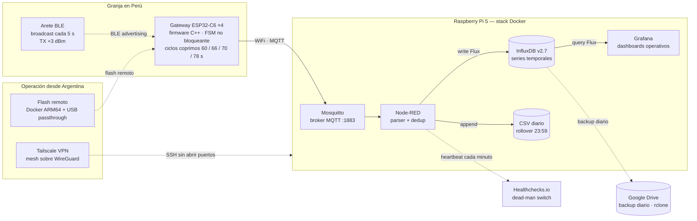
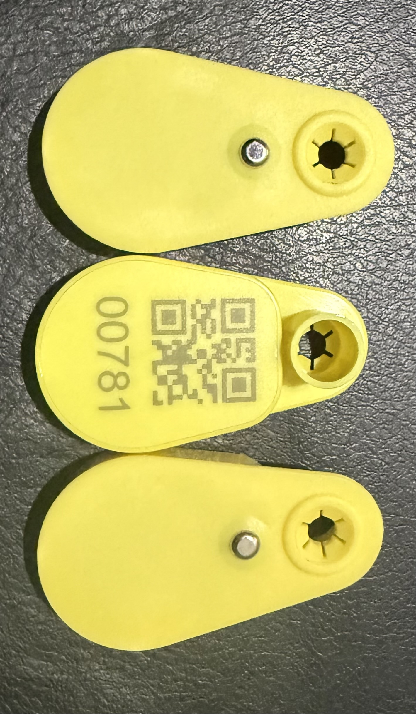
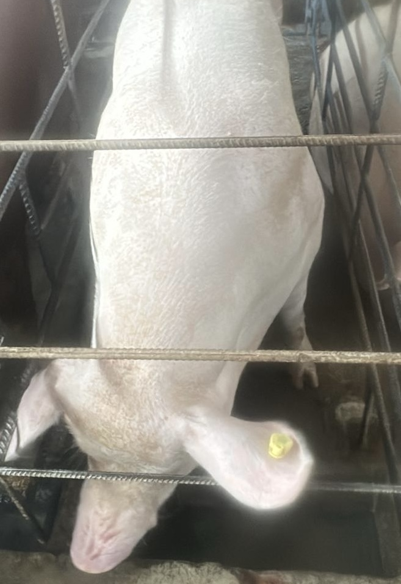
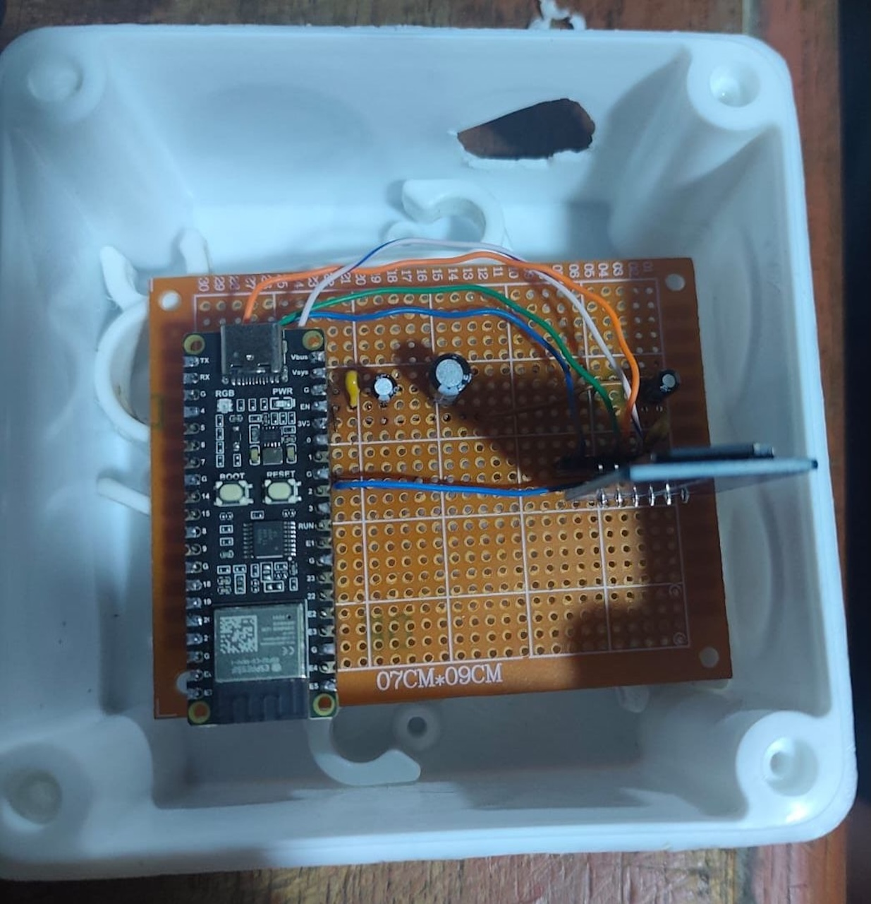
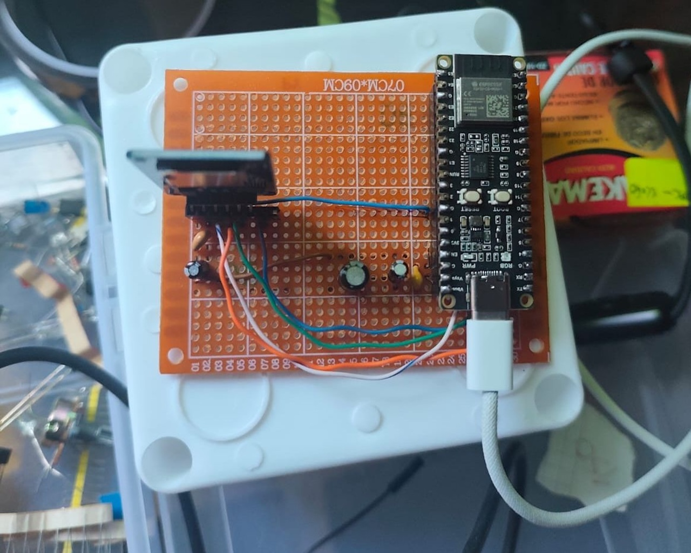
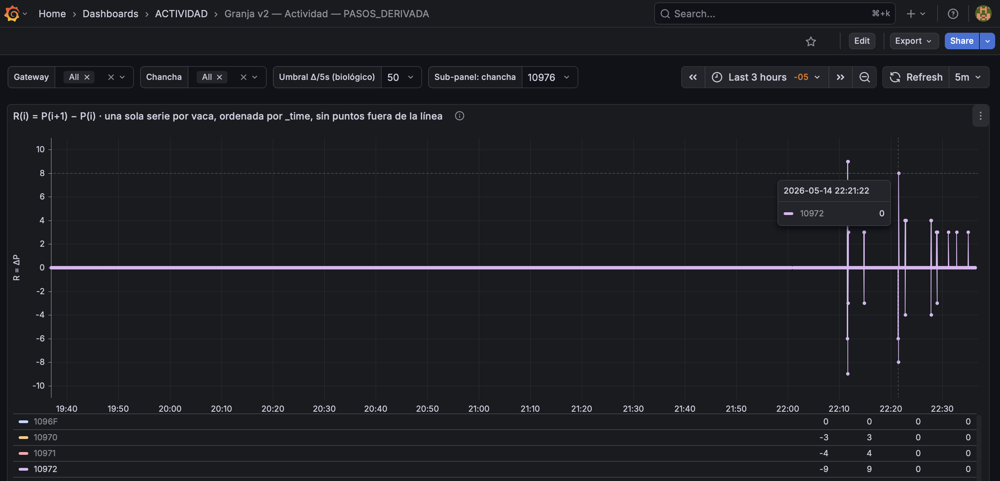
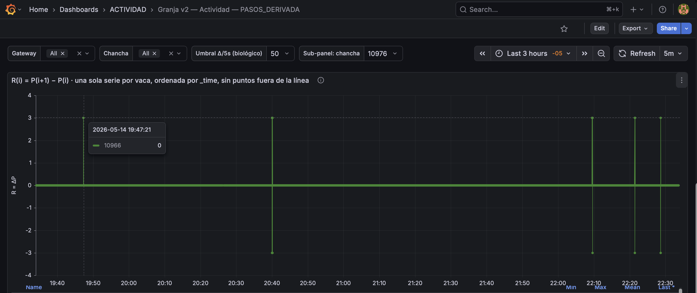
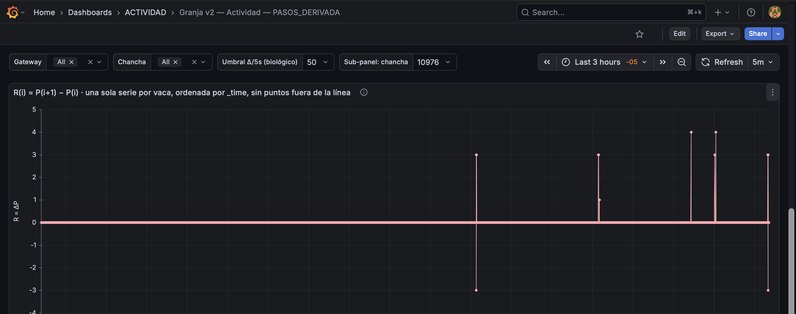
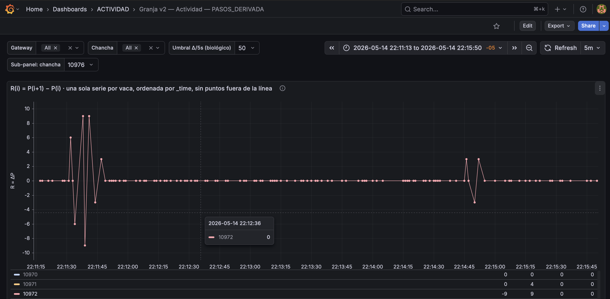

<h1 align="center">CrotCow — Plataforma IoT de telemetría para ganadería</h1>

  <em>Sistema de telemetría continua en arete BLE para granjas. Piloto productivo en una granja porcina del Perú desde 2024, con operación remota desde Argentina y desarrollo activo de la capa analítica predictiva.</em>

  
  
  
  
  
  

---

## Índice

1. [Resumen ejecutivo](#1-resumen-ejecutivo)
2. [Estado del proyecto](#2-estado-del-proyecto)
3. [Arquitectura](#3-arquitectura)
4. [Capturas del sistema en producción](#4-capturas-del-sistema-en-producción)
5. [Decisiones técnicas revelables](#5-decisiones-técnicas-revelables)
6. [Resultados cuantitativos](#6-resultados-cuantitativos)
7. [Stack técnico](#7-stack-técnico)
8. [Contacto](#8-contacto)
9. [Sobre el autor](#9-sobre-el-autor)
10. [Licencia](#10-licencia)

---

## 1. Resumen ejecutivo

CrotCow es una plataforma de telemetría IoT para ganadería con arquitectura propietaria end-to-end: arete BLE en la oreja del animal, gateways edge sobre ESP32-C6 con firmware C++, broker MQTT, pipeline de adquisición en Node-RED, base de datos de series temporales y dashboards operativos. El piloto productivo opera de forma ininterrumpida desde 2024 en una granja porcina del Perú, mientras la operación, el firmware y la capa analítica se mantienen remotamente desde Argentina sobre Tailscale VPN.

Este repositorio reúne **documentación técnica pública** del sistema y de las decisiones de ingeniería detrás del piloto. El firmware embebido, los esquemáticos del arete BLE y el backend analítico predictivo son propietarios y no forman parte de este repositorio.

---

## 2. Estado del proyecto

| Componente | Estado | Notas |
|---|---|---|
| Firmware del gateway (C++, ESP32-C6) | Operativo | Doce correcciones de campo aplicadas tras el primer despliegue |
| Backend de adquisición (MQTT + Node-RED + InfluxDB) | Operativo | 18 meses sin pérdida de datos en el piloto |
| Operación remota (Tailscale + flash remoto) | Operativa | Argentina ↔ Perú, latencia SSH típica < 250 ms |
| Backup offsite (rclone → Google Drive) | Operativo | Rotación diaria automática a las 03:00 |
| Capa analítica predictiva (CUSUM, Z-score, bout length) | En desarrollo | Calibración pendiente con eventos reproductivos observados |
| Sistema de alertas (Telegram / email) | En desarrollo | A construir sobre la capa analítica |
| Sitio web público (`crotcow.com`) | En desarrollo | Aún no disponible; el servicio mismo continúa en fase de I+D |
| Extensión a ganado extensivo (LoRaWAN) | Roadmap | Depende del cierre de la capa analítica del piloto |

- **Granja piloto:** una granja porcina en Perú con uso operativo de este sistema desde 2024.
- **Repositorio fuente:** privado.

---

## 3. Arquitectura

**Decisiones de arquitectura clave:**

- **Edge-first, sin cloud crítico.** Todo el pipeline operativo (broker, ingesta, base de datos, dashboards) corre dentro de la granja sobre una Raspberry Pi 5. Un corte de internet no interrumpe la grabación de datos — solo el acceso remoto.
- **Redundancia por número, no por costo.** Cuatro gateways ESP32-C6 económicos en lugar de un gateway industrial. La pérdida natural de BLE *advertising* (~65 % por nodo) se compensa con la fórmula `1 − (1 − p)ⁿ`: la captura efectiva sube de 35 % a 82 %.

- **Reproducibilidad declarativa.** `docker compose up -d` levanta el stack completo desde cero. Grafana se aprovisiona con dashboards y datasources versionados en JSON. Una segunda granja se replica con `git clone + un archivo .env`.

---

## 4. Capturas del sistema en producción

> Las capturas pueden corresponder a versiones recientes del piloto. Los identificadores de animales y los rangos horarios son de la granja y no contienen información sensible.

**Arete BLE colocado en la oreja del animal:**

El crotal BLE se aplica de forma análoga a un arete sanitario convencional. La emisión BLE con +3 dBm asegura cobertura en condiciones de obstrucción típicas de una nave porcina.

**Otra vista del despliegue real:**

**Gateway ESP32-C6 en campo:**

  
  

Cada gateway integra un módulo ESP32-C6 (RISC-V, WiFi 6, BLE 5) con coexistencia de antena 2.4 GHz, alimentación 5 V y firmware C++ con máquina de estados de 8 estados. Los 4 gateways operan en ciclos coprimos (60 / 66 / 70 / 78 s) para que las ventanas de upload por WiFi no se superpongan de forma permanente. La unidad cuesta dos órdenes de magnitud menos que un gateway industrial equivalente.

**Dashboard operativo — panel `ACTIVIDAD / PASOS_DERIVADA` en Grafana:**

El panel central del dashboard de operación calcula la derivada del contador de pasos por animal, `R(i) = P(i+1) − P(i)`, agrupada por animal y ordenada por `_time`. Cada punto es el incremento de pasos en la ventana BLE de 5 s entre dos broadcasts consecutivos del mismo crotal.

*Vista panorámica — múltiples animales sobre 3 horas:*

*Animal en reposo — animal 10966 sobre 3 horas:*

*Animal activo — animal 10972 sobre 3 horas:*

Mismo panel filtrado a un crotal con eventos visibles dentro de la ventana. Cada marcador vertical es la diferencia entre dos lecturas consecutivas del contador del crotal: incrementos típicos de +3 a +4 pasos por ventana de 5 s. Los valores negativos corresponden a eventos de menor frecuencia que el panel preserva para diagnóstico; la capa analítica los filtra antes del cálculo de métricas.

*Anatomía de un* bout *de actividad — zoom de ~4 minutos:*

Misma serie con `time range` ajustado a 4 minutos. Se observa la estructura típica de un episodio de actividad: arranque súbito con picos de hasta ±9 pasos por ventana de 5 s, seguido de un retorno rápido a la línea base. Este nivel de detalle es el que alimenta a las métricas analíticas en desarrollo.

---

## 5. Decisiones técnicas revelables

### 5.1 Cuatro gateways en lugar de uno más potente

La pérdida natural en BLE *advertising* ronda el 65 % por gateway debido a la naturaleza no-conectable del protocolo (sin ACK). Con la fórmula `1 − (1 − p)ⁿ`, el salto de 1 a 4 gateways eleva la captura efectiva de 35 % a 82 %. El siguiente salto (5 GW) solo aporta +8 %, lo que ubica el punto óptimo en 4. La redundancia entrega además degradación controlada: la caída de un gateway baja la captura de 82 % a 72 %, no a cero.

### 5.2 Ciclos coprimos entre gateways (60 / 66 / 70 / 78 s)

El ESP32-C6 dispone de un único radio 2.4 GHz: durante la transmisión WiFi, el radio deja de escuchar BLE. Si los cuatro gateways operaran con el mismo período, sus *ventanas ciegas* WiFi coincidirían y la pérdida afectaría a los mismos paquetes. Los ciclos coprimos garantizan que las ventanas de upload nunca se solapen de forma permanente.

### 5.3 InfluxDB v2 en lugar de Postgres + TimescaleDB

El uso real del sistema es 100 % series temporales con agregaciones por ventana. InfluxDB v2 está optimizado para esa carga, con Flux como lenguaje declarativo para `aggregateWindow`, `difference`, `stddev` y `reduce` con estado. La misma consulta sobre Postgres + TimescaleDB resulta más verbosa y menos eficiente para los rangos cortos (1 / 5 / 15 min) que demanda el monitoreo operativo.

---

## 6. Resultados cuantitativos

| Métrica | Valor |
|---|---|
| Operación continua del piloto | 18 meses ininterrumpidos |
| Sensores activos en campo | 30 |
| Gateways redundantes | 4 ESP32-C6 |
| Captura BLE tras 12 correcciones de firmware | 62 % |
| Captura del mejor sensor | 79 % |
| Latencia end-to-end ADV → dashboard | 1–5 s |
| Latencia SSH Argentina ↔ Perú | < 250 ms |

---

## 7. Stack técnico

| Capa | Tecnologías |
|---|---|
| Embebido | C/C++ · Arduino framework · arduino-cli · ESP32-C6 · FreeRTOS |
| Mensajería | MQTT 3.1.1 (QoS 2) · Mosquitto 2 · WebSocket 9001 |
| Procesamiento | Node-RED · JavaScript en *function nodes* · validación de timestamps |
| Series temporales | InfluxDB v2.7 · Flux · retención 365 d |
| Visualización | Grafana Enterprise · provisioning declarativo (JSON versionado) |
| Análisis | Python 3 · pandas · pyarrow · Jupyter · escritura Parquet atómica |
| Infraestructura | Raspberry Pi 5 · Debian 13 ARM64 · Docker + Compose · disco USB-C externo · Portainer |
| Redes | Tailscale (mesh WireGuard) · SSH · USB passthrough sobre SSH |
| Operación | cron · rclone (OAuth Google Drive) · Healthchecks.io · systemd |

---

## 8. Contacto

Para consultas técnicas, demostraciones guiadas a reclutadores o partners, evaluación del enfoque o discusión de proyectos relacionados con telemetría IoT en ganadería:

- Correo profesional: **[ymonzon@fi.uba.ar](mailto:ymonzon@fi.uba.ar)** — canal preferente para reclutadores, partners técnicos y consultas académicas.
- CV (PDF): disponible bajo pedido al correo profesional.
- Sitio web público: `crotcow.com` aún no disponible; el servicio continúa en desarrollo.

---

## 9. Sobre el autor

**Yerson Monzón Alayo.** Estudiante avanzado de Ingeniería en Electrónica en la Facultad de Ingeniería de la Universidad de Buenos Aires (FIUBA), con graduación prevista en 2027. Áreas de trabajo: sistemas embebidos, IoT, telemetría inalámbrica, análisis de series temporales y operación de infraestructura autohospedada.

Cinco años de experiencia en capacitación técnica formal, con más de 100 estudiantes formados en 18 universidades hispanohablantes. Disponible para roles de ingeniería embebida, IoT o backend en Argentina y para esquemas de trabajo remoto internacional.

---

## 10. Licencia

Este repositorio (documentación pública del proyecto CrotCow) se distribuye bajo licencia **Creative Commons Atribución-NoComercial 4.0 Internacional** ([CC BY-NC 4.0](https://creativecommons.org/licenses/by-nc/4.0/deed.es)).

**Cobertura de la licencia:**

- Incluye la documentación contenida en este repositorio (README, diagramas, capturas, descripciones de arquitectura y casos de ingeniería).
- No incluye el firmware embebido del gateway (propietario, repositorio privado).
- No incluye los esquemáticos ni el firmware del arete BLE (propietarios).
- No incluye los scripts de análisis estadístico predictivo ni la capa de alertas (propietarios).
- No incluye el nombre, el logotipo ni los activos de marca asociados al proyecto (todos los derechos reservados).

Cualquier uso comercial de la documentación pública requiere autorización previa por escrito del autor.

---

*Última actualización: mayo 2026.*
